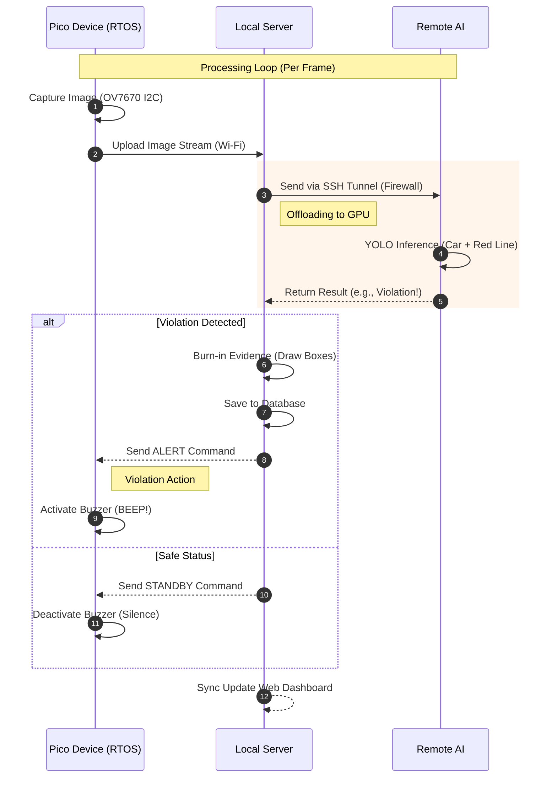
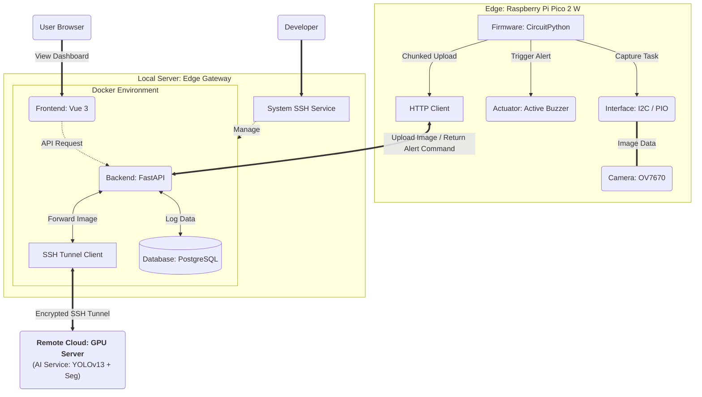

# NTUT_EmbeddingSystemFinal

This project is a smart AIoT traffic monitoring system that combines Edge Computing and cloud microservices.

It utilizes a Raspberry Pi Pico 2 W as the edge capture device to monitor traffic in real-time. The captured images are uploaded to a local backend server, which then securely forwards data to a remote GPU server via an SSH Tunnel. There, computer vision technology (YOLOv13 + YOLOv11-seg) automatically detects vehicles illegally parked in red zones.

## Quick Start

This project is fully containerized. Please ensure **Docker** and **Docker Compose** are installed in your environment.

### IoT Device Setup (Real or Simulated)

**Real Device (Pico 2 W)**: Flash the pico0v7670.py firmware onto your Raspberry Pi Pico 2 W.

**Simulation (mock_pico.py)**: Simulates the Pico's behavior by periodically sending test images to the backend API, allowing full system testing (Frontend -> Backend -> AI) without the actual embedded device.

### Start Services

Run the following command in the project root directory:

```bash
docker-compose up -d
````

The system will automatically build and start the following services:

  * **Frontend (User Interface)**: http://localhost:5173
  * **Backend (API Docs)**: http://localhost:8000/docs

### Stop Services

```bash
docker-compose down
```

## System Features

1.  **Real-time Dashboard**

      * Provides live image streaming.
      * Displays real-time system status (Safe / Detecting Violation) and visualized AI inference results.

2.  **Manual Test**

      * Provides an image upload interface to simulate the AI analysis process.
      * Returns detailed detection data.

3.  **Violation History**

      * Automatically saves evidence images when a violation occurs.
      * Records the violation timestamp, reason, and detailed status.
      * Provides a grid-view interface for browsing history.

## Sequence Diagram


## System Architecture

The system adopts a **Cloud-Edge Collaboration** design:

* **Edge Device (Pi Pico 2 W)**: Captures real-time traffic images via a camera module and uploads them via Wi-Fi.
* **Remote AI Service**: Uses YOLO object detection and semantic segmentation.
* **Backend**: Handles business logic, IoU calculation, database access, and image processing.
* **Frontend**: Handles data visualization and user interaction.
* **SSH Tunnel**: A secure, encrypted pipeline that allows the local backend to communicate with the remote AI Service.

## Tech Stack

* **Hardware / Edge**: Raspberry Pi Pico 2 W, Camera Module (OV7670)
* **Firmware**: CircuitPython
* **Frontend**: Vue 3, Vite, Tailwind CSS
* **Backend**: FastAPI
* **Database**: PostgreSQL
* **AI Service**: YOLOv13 (Object Detection), YOLOv11-seg (Instance Segmentation)
* **Connectivity**: SSH Tunneling, HTTP/REST
* **Infrastructure**: Docker, Docker Compose

## Project Structure

```text
NTUT_EmbeddingSystemFinal/
│
├── pico0v7670.py               # Source code for the actual IoT device (Raspberry Pi Pico2 W)
├── mock_pico.py                # IoT Edge Device Simulation (Simulates Pi Pico2 W behavior)
├── docker-compose.yml          # Container orchestration config
├── .gitignore                  # Git ignore settings
│
├── ssh_config/                 # SSH credentials directory
│   └── config                  # SSH configuration file for tunneling
│
├── ai_service/                 # AI Service (YOLO)
│   ├── environment.yaml        # Python dependency list
│   ├── mock_yolo.py            # For testing
│   ├── test_seg_inference.py   # For testing
│   └── yolov13_fastapi_api.py  # Core logic: vehicle detection & red line segmentation
│
├── backend/                    # Backend API Service (FastAPI)
│   ├── Dockerfile              # Docker image config for Backend
│   ├── environment.yaml        # Python dependency list
│   ├── main.py                 # API Entry: Handles image uploads & violation logic
│   ├── config.py               # Global configuration settings
│   ├── state.py                # Global state management (In-memory storage)
│   ├── models.py               # Database models definition (SQLAlchemy)
│   ├── database.py             # Database connection settings
│   ├── entrypoint.sh           # Startup script: Initializes SSH keys and tunnels
│   ├── ssh_tunnel.py           # Logic for establishing the SSH Reverse Tunnel
│   └── static/                 # Static file storage
│       └── uploads/            # Storage for violation evidence images
│
└── frontend/                   # Frontend Interface (Vue 3 + Vite)
    ├── Dockerfile              # Docker image config for Frontend
    ├── package.json            # NPM dependency list
    ├── vite.config.js          # Vite build configuration
    ├── index.html              # HTML entry point
    └── src/
        ├── main.js             # Vue application entry
        ├── App.vue             # Root component
        ├── router.js           # Vue Router configuration
        ├── components/         # Shared components
        │   └── navbar.vue      # Navigation bar
        └── views/              # Page components
            ├── index.vue       # Dashboard (Live monitoring)
            ├── upload.vue      # UploadTest (Manual testing page)
            └── history.vue     # History (Violation records page)
```
